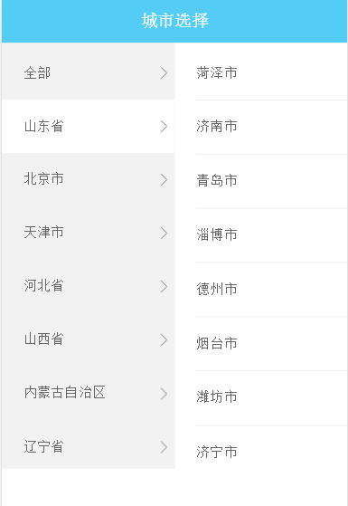

# Mobile-City-Select
移动端城市选择插件(持续维护更新 / 喜欢的帮忙点颗星 / 问题交流Q群：573078465)

## demo test



# demo:
## css:
````
<link rel="stylesheet" href="css/style.css" />
````
## dom
```
<!--触发按钮-->
<a id="citySelect" class="citySelect" href="javascript:void(0);">城市选择</a>
<!--显示省市区选择模块-->
<div id="cityBody" class="cityChoose clearfix">
	<div class="leftSelect">
	</div>
	<div class="rightSelect">
	</div>
</div>
```
## js
```
<script type="text/javascript" src="js/jquery.min.js" ></script>
<script type="text/javascript" src="js/citydata.js" ></script>
<script type="text/javascript" src="js/Mobile-City-Select.js" ></script>
<script type="text/javascript">
$(function(){
	mobileCitySelectinit();
	$('#citySelect').on('click',function(){
		$(this).toggleClass('active');
		$("#cityBody").slideToggle();
	});
})
</script>
```
